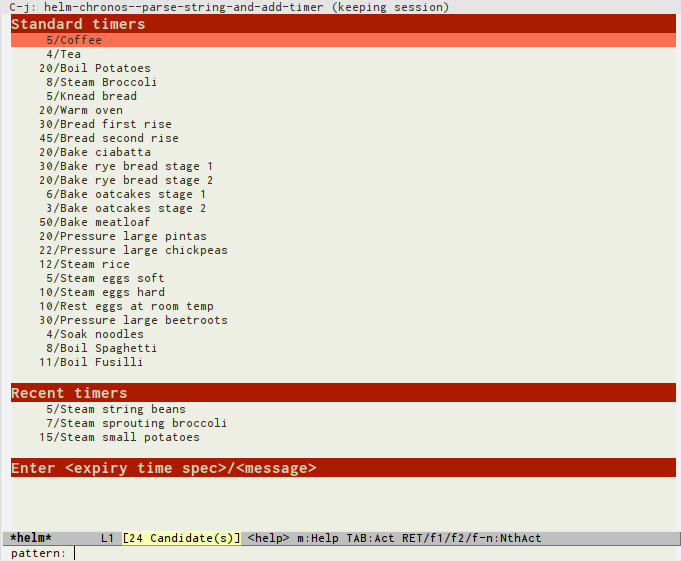
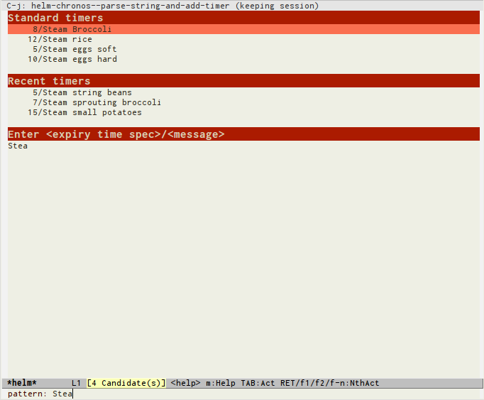
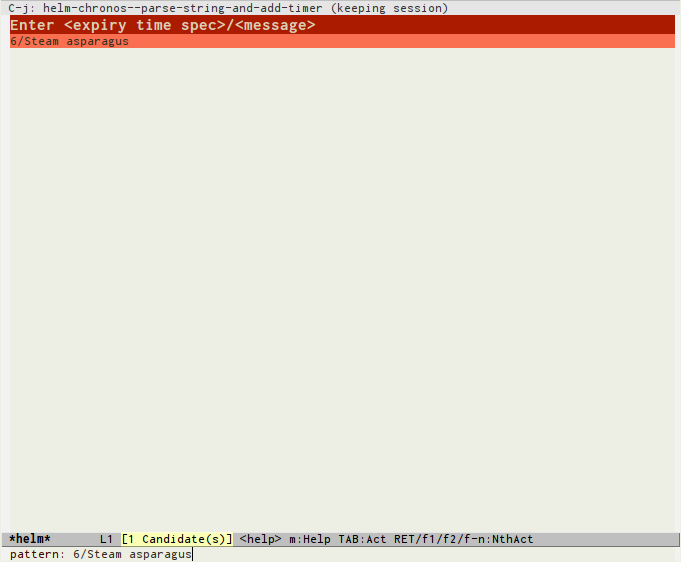
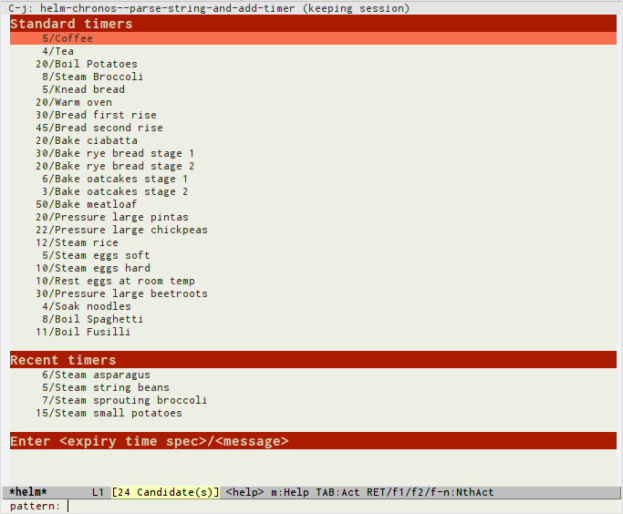

# Helm-chronos

A Helm interface to chronos, the multiple countdown/countup timer
package for Emacs https://github.com/dxknight/chronos.

# Installation

You should already have helm and chronos installed.

Put helm-chronos.el somewhere Emacs can find it and run `(require
'helm-chronos)`.

`M-x helm-chronos-add-timer` will pop up a helm interface to match the pattern
you enter against predefined timers.  If no timer matches your pattern, a timer
definition can be entered directly.

In helm-chronos, the format for timers is a string consisting of a
chronos expiry time specification and a message, separated by /.  For
example: "5/Coffee" would be for a timer expiring in five minutes with
the message "Coffee".

# Example

I want to steam some asparagus.  I have already defined some standard timers in
the list `helm-chronos-standard-timers`, and there are a few recent timers I
entered in this or previous sessions.

I narrow the selections by starting to type `steam`.  By the time I get to
`stea`, I can see there is no steamed asparagus timer available.

I go to the start of the search pattern and clear it with `C-a C-k`, then enter
a suitable timer specification of six minutes to steam the asparagus: 6/Steam
asparagus.  After pressing enter, the timer is started.

The next time I call `helm-chronos-add-timer`, I see that 6/Steam asparagus has
been included as a recent timer.

